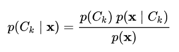
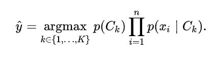

# Naive-Bayes-Classifier
Build binary class classifier based on Naive Assumption.

## Description
Here I build a naive bayse classifier which identified whether a given movie review showed subjectivity (1) or objectivity (0). The training data I use is "polarity dataset v2.0" from Cornell University.

This algorithm is based on Baysian theorem, where the posterior possibility could be calculated through prior possibility, likelihood and evidence. 

We use this theorem in the model and calculate the possibility of data(x) to be a specific class of y in all possible conditions, and select the most promising one.

The codes are in the bayes.py file. The main fuctions are in __class Naivebayes__, while other data-prepossessing functions like word tokenization, word mapping and word vetorization are also included. I also write a k-fold cross validation testing to test the performance of the model.

Currently, this model only could be used for binary classification; However, with a slight modification, the model could also be used for multi-class classification. 
